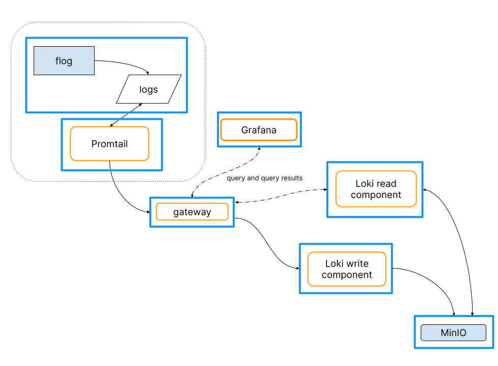

# Getting started with Grafana Loki

> **Note:** You can use [Grafana Cloud](https://grafana.com/products/cloud/features/#cloud-logs) to avoid installing, maintaining, and scaling your own instance of Grafana Loki. The free forever plan includes 50GB of free logs. [Create an account to get started](https://grafana.com/auth/sign-up/create-user?pg=docs-loki&plcmt=in-text).

This guide assists the reader to create and use a simple Loki cluster.
The cluster is intended for testing, development, and evaluation;
it will not meet most production requirements.

The test environment runs the [flog](https://github.com/mingrammer/flog) app to generate log lines.
Promtail is the environment's agent (or client) that captures the log lines and pushes them to the Loki cluster through a gateway.
In a typical environment, the log-generating app and the agent run in different locations. This guide simulates that by running Loki in Docker containers while flog and the Promtail agent run outside of Docker containers.

In this guide, Grafana provides a way to pose and visualize queries against the logs stored in Loki.
 


The test environment uses Docker compose to instantiate these services, each in its own container: 

- One [single scalable deployment](../fundamentals/architecture/deployment-modes/) mode **Loki** instance has:
    - One Loki read component
    - One Loki write component
- **Minio** is the storage back end.
- The **gateway** receives requests and redirects them to the appropriate container based on the request's URL.
- **Grafana** provides visualization of the log lines captured within Loki.

The flog app and Promtail are run on your local machine,
to make them easy to modify.

## Prerequisites

- [Docker](https://docs.docker.com/install)
- [Docker Compose](https://docs.docker.com/compose/install)
- The [flog](https://github.com/mingrammer/flog) app, to be run outside of a Docker environment.

## Obtain and configure the test environment

1. Create a directory for the test environment; make that new directory your current working directory:
    ```bash
    mkdir evaluate-loki
    cd evaluate-loki
    ```
1. Download `loki-config.yaml`, `promtail-local-config.yaml`, and `docker-compose.yaml`:

    ```bash
    wget https://raw.githubusercontent.com/grafana/loki/main/production/simple-scalable/loki-config.yaml -O loki-config.yaml
    wget https://raw.githubusercontent.com/grafana/loki/main/production/simple-scalable/promtail-local-config.yaml -O promtail-local-config.yaml
    wget https://raw.githubusercontent.com/grafana/loki/main/production/simple-scalable/docker-compose.yaml -O docker-compose.yaml
    ```
1. The `docker-compose.yaml` relies on the Loki docker driver, aliased to `loki-compose`, to send logs to the Loki cluster. If this driver is not installed on your system, you can install it by running the following:

    ```bash
    docker plugin install grafana/loki-docker-driver:latest --alias loki-compose --grant-all-permissions
    ```
    If this driver is already installed, but under a different alias, you will have to change `docker-compose.yaml` to use the correct alias.
1. Modify the Promtail configuration file to scrape the output of the flog app. Edit `promtail-local-config.yaml`. Change the `__path__` value `/path/to/flog.log` to be the path to your current working directory, which is the test environment's directory.

    Within Promtail configuration, the `scrape_configs` YAML block specifies the logs to scrape.

1. Download and install Promtail.
    1. On the [Loki](https://github.com/grafana/loki) home page, locate and click on the most recent release.  At the bottom of the releases's page are the Assets.  Find and download the Promtail ZIP file for your operating system and architecture.
    1. Uncompress the binary.  For example:
        ```bash
        unzip promtail-linux-amd64.zip
        ```

## Deploy the test environment

All shell commands are issued from the test environment's directory.

1. Deploy Grafana and the Loki cluster with `docker-compose`:
    ```bash
    docker-compose up
    ```
1. (Optional) Verify that the Loki cluster is up and running. The read component returns `ready` when you point a web browser at http://localhost:3101/ready. The message `Query Frontend not ready: not ready: number of schedulers this worker is connected to is 0` will show prior to the read component being ready.
The write component returns `ready` when you point a web browser at http://localhost:3102/ready. The message `Ingester not ready: waiting for 15s after being ready` will show prior to the write component being ready.
1. Run the `flog` app to start generating log lines.
This example generates 100 log lines in JSON format, at intervals of 5 seconds:
    ```bash
    flog -f json -o flog.log -t log -n 100 -d 5s
    ```
1. Run Promtail to capture the log lines and push them to the Loki cluster. Your binary's name may be different than this example:
    ```bash
    ./promtail-linux-amd64 -config.file promtail-local-config.yaml
    ```

## Use Grafana and the test environment

This guide uses Grafana to query and observe the log lines captured in the Loki cluster.

Use Grafana to query and observe the log lines captured in the Loki cluster by navigating a browser to http://localhost:3000.
The Grafana instance has Loki configured as a [datasource](https://grafana.com/docs/grafana/latest/datasources/loki/).

Click on the Grafana instance's [Explore](https://grafana.com/docs/grafana/latest/explore/) icon to bring up the log browser.

Use the Explore dropdown menu to choose the Loki datasource.

Use Grafana to try some queries.
Enter your query into the **Log browser** box, and click on the blue **Run query** button.

To see all the log lines that flog has generated:
```
{job="flog"}
```

The flog app will generate log lines for invented HTTP requests.
To see all `GET` log lines, enter the query:

```
{job="flog"} |= "GET"
```
For `POST` methods:
```
{job="flog"} |= "POST"
```

To see every log line with the value of `401`: 
```
{job="flog"} |= "401"

```
To see every log line other than those the value `401`: 
```
{job="flog"} != "401"
```

## Stop and clean up the test environment

To break down the test environment:

- Close the Grafana browser window

- Stop and remove all the Docker containers. With current working directory of the test environment:
    ```bash
    docker-compose down
    ```

- Use SIGINT to stop Promtail.

- Use SIGINT to stop the flog app, if it hasn't already stopped generating log lines.

- If you wish to restart the test environment, remove the generated `flog.log` file.
